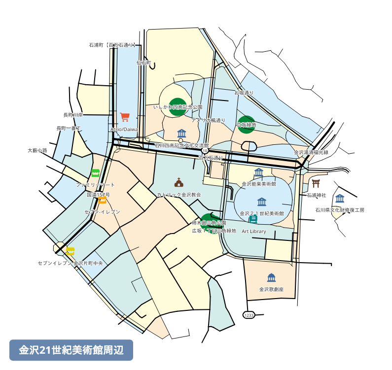
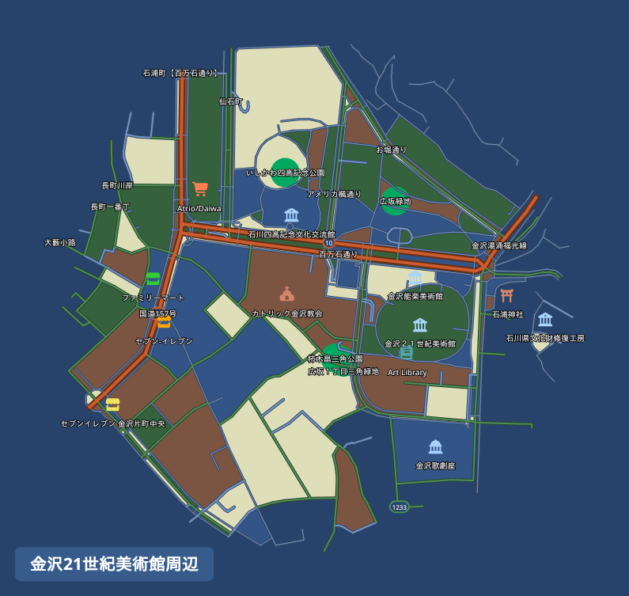
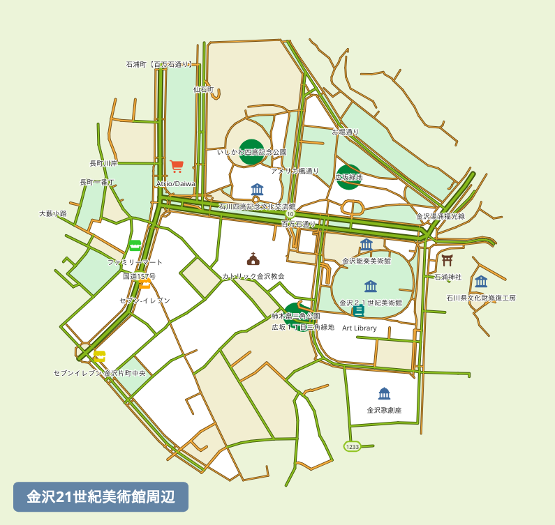
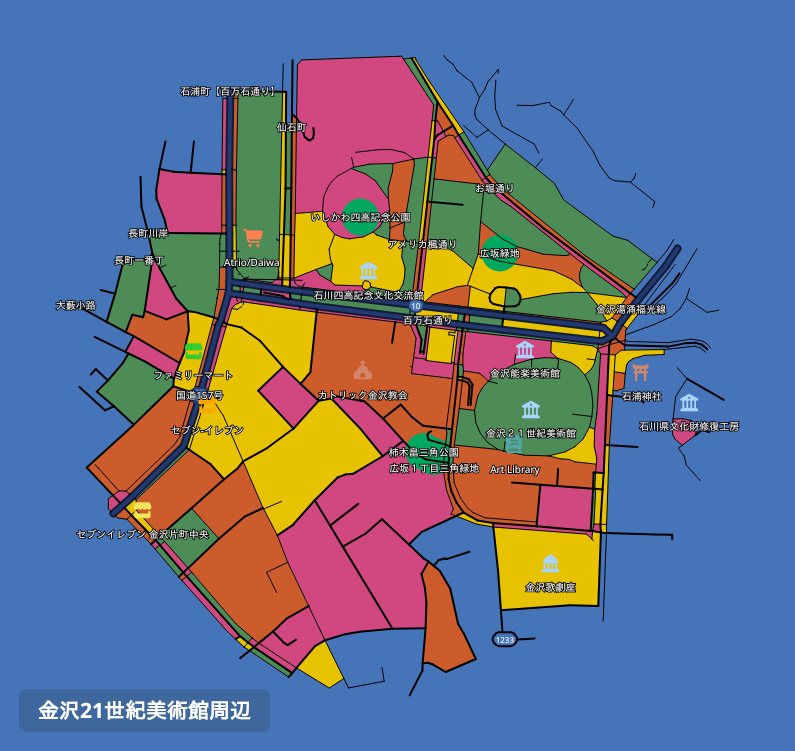
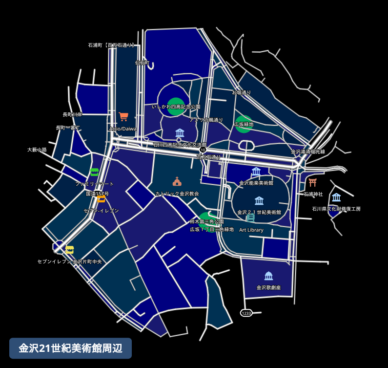

# mapnetwork-mcp

MCP server for [MapNetwork](https://mapnetwork.app) — generate styled map images (PNG / SVG) for any location on Earth, directly from Claude or any MCP-compatible AI assistant.

## Features

- Generate maps from a place name, coordinates, or a list of markers
- 11 color themes (white, darkBlue, darkGreen, popArt, lightBlue, lightGreen, beige, magenta, gray, black, brawn)
- Overlay walking / driving routes on the map
- PNG or SVG output, saved to your Downloads folder
- Re-download a previously generated map in a different theme or format without regenerating
- Open any generated map in the MapNetwork web editor for manual customization

## Example Usage

**Prompt:** "Generate a map around the 21st Century Museum of Contemporary Art, Kanazawa."

Here is the map it generated:


**Prompt:** "Redownload that map in a few different color themes."

The same map, redownloaded in different color themes:

|                       Dark Blue Style                        |                       Light Green Style                        |                          Pop Art Style                           |                        Black Style                        |
|:------------------------------------------------------------:|:--------------------------------------------------------------:|:----------------------------------------------------------------:|:---------------------------------------------------------:|
|  |  |  |  |

## Installation

### Claude Desktop

Add the following to your `claude_desktop_config.json`:

```json
{
  "mcpServers": {
    "mapnetwork": {
      "command": "uvx",
      "args": ["mapnetwork-mcp"],
      "alwaysAllow": ["generate_map", "compute_route", "redownload_map"]
    }
  }
}
```

If you use `pip` instead of `uvx`:

```bash
pip install mapnetwork-mcp
```

```json
{
  "mcpServers": {
    "mapnetwork": {
      "command": "mapnetwork-mcp"
    }
  }
}
```

## Tools

| Tool | Description |
|---|---|
| `generate_map` | Generate a styled map image for a location and save it to Downloads |
| `compute_route` | Compute a walking or driving route between two locations |
| `redownload_map` | Re-download a previously generated map in a different color theme or format |

## Example prompts

**Japanese**
- "渋谷駅周辺の地図を作って"
- "赤坂駅から赤坂氷川神社までの徒歩ルートを地図にして"
- "東京駅・日本橋駅・京橋駅を1枚の地図に表示して"
- "その地図を darkBlue テーマでSVG画像で出し直して"

**English**
- "Generate a map around Shibuya Station"
- "Show a walking route from Akasaka Station to Akasaka Hikawa Shrine on a map"
- "Put Tokyo Station, Nihonbashi Station, and Kyobashi Station on a single map"
- "Redownload that map as an SVG in the darkBlue theme"

## Links

- Web UI: [https://mapnetwork.app](https://mapnetwork.app)
- API docs: [https://mapnetwork.app/openapi.json](https://mapnetwork.app/openapi.json)

mcp-name: io.github.toruproject/mapnetwork-mcp
